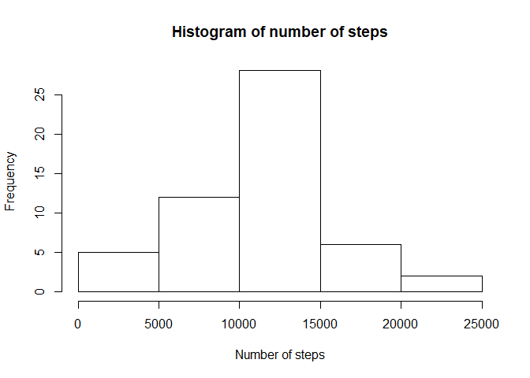
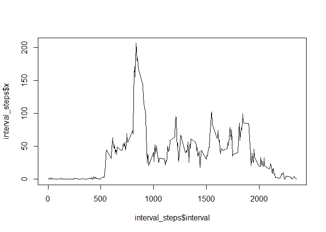
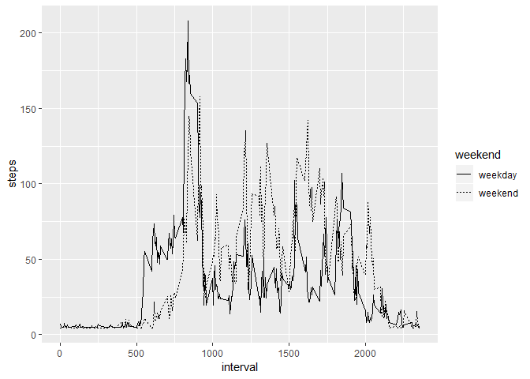

## Loading and preprocessing the data

```r
df <-read.csv("activity.csv")
```

## What is mean total number of steps taken per day?

```r
daily_steps <-aggregate(df$steps, by = list(date=df$date), FUN=sum)
print("Mean:",str(mean(daily_steps$x, na.rm = TRUE))) 
```

```
##  num 10766
## [1] "Mean:"
```

```r
print("Median:", str(median(daily_steps$x, na.rm = TRUE)))
```

```
##  int 10765
## [1] "Median:"
```

```r
hist(daily_steps$x, xlab = "Number of steps", main = "Histogram of number of steps")
```

<!-- -->

## What is the average daily activity pattern?

```r
df_no_na <- na.omit(df)
interval_steps <-aggregate(df_no_na$steps, by = list(interval=df_no_na$interval), FUN=mean)
plot(x=interval_steps$interval, y=interval_steps$x, type="l")
```

<!-- -->


## Imputing missing values

```r
sum(is.na(df))
```

```
## [1] 2304
```

```r
df[is.na(df$steps), "steps"] <- mean(na.omit(df$steps))
daily_steps <-aggregate(df$steps, by = list(date=df$date), FUN=sum)
print("Mean:",str(mean(daily_steps$x, na.rm = TRUE))) 
```

```
##  num 10766
## [1] "Mean:"
```

```r
print("Median:", str(median(daily_steps$x, na.rm = TRUE)))
```

```
##  num 10766
## [1] "Median:"
```


## Are there differences in activity patterns between weekdays and weekends?

```r
require("ggplot2")
```

```
## Loading required package: ggplot2
```

```r
df$weekend<-mapply(weekdays(as.Date(df$date)), FUN= function(x) if (x %in% c('zaterdag', 'zondag')){"weekend"} else {"weekday"})

temp <- aggregate(x = list(steps=df$steps), by=list(interval=df$interval, weekend=df$weekend), FUN="mean")

ggplot(temp, aes(x = interval, y = steps, group=weekend)) + geom_line(aes(linetype=weekend))
```

<!-- -->
